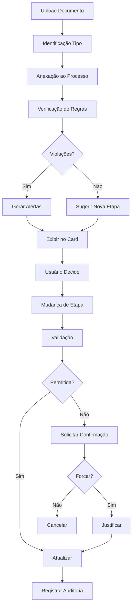

# Sistema de Regras de Negócio para Processos de Importação

## Visão Geral

Este documento detalha a implementação do sistema de regras de negócio para gerenciamento de processos de importação, incluindo validações automáticas, mudança de etapas, auditoria e alertas de inconsistências.

## Arquitetura

### Componentes Principais

1. **ProcessBusinessRules Service** (`src/lib/services/ProcessBusinessRules.ts`)
   - Serviço central que implementa todas as regras de negócio
   - Validação de documentos obrigatórios
   - Verificação de transições de etapas
   - Sugestão automática de etapas baseada em documentos

2. **API Routes**
   - `/api/processo-importacao/update-stage` - Atualização de etapas com validação
   - `/api/processo-importacao/check` - Verificação de status e documentos
   - `/api/processo-importacao/audit-logs` - Registro e consulta de auditoria

3. **Componentes UI**
   - `ProcessoImportacaoCard` - Card com visualização de etapa e alertas
   - `DocumentsTable` - Tabela de documentos anexados
   - `StageChangeModal` - Modal para mudança de etapa com validações
   - `BusinessRuleAlerts` - Componente de alertas de inconsistências
   - `StageAuditLog` - Histórico de mudanças de etapa

## Regras de Negócio Implementadas

### RN-01: Proforma Invoice Obrigatória
- Todo processo deve ter uma Proforma Invoice anexada
- Validação crítica (erro) quando ausente
- Bloqueia avanço para outras etapas

### RN-02: Etapa Solicitado
- Requer Proforma Invoice ou Commercial Invoice
- Validação de aviso quando ambos estão ausentes

### RN-03: Processos sem Documentos
- Processos sem documentos prioritários permanecem em "Solicitado"
- Implementado através da sugestão automática de etapa

### RN-04: Transição para Em Transporte Internacional
- Ativada quando BL (Bill of Lading) é anexado
- Sistema sugere mudança automática
- Documentos aceitos em Solicitado:
  - Proforma Invoice
  - Numerário
  - Contrato de Câmbio
  - SWIFT
  - Commercial Invoice
  - Packing List

### RN-05: Transição para Processamento Nacional
- Ativada quando DI (Declaração de Importação) é anexada
- Requer BL como pré-requisito
- Sistema sugere mudança automática

### RN-06: Em Transporte Local
- Mudança manual apenas
- Não tem triggers automáticos

### RN-07: Etapa Recebido
- Condicionada à existência de Nota Fiscal
- Sistema sugere quando NF é detectada

### RN-08: Controle Manual com Alertas
- Usuário pode forçar mudanças de etapa
- Sistema exibe alertas sobre documentos faltantes
- Requer justificativa para mudanças forçadas

### RN-09: Auditoria de Mudanças
- Todas as mudanças são registradas em LOGS_IMPORTACAO
- Registra:
  - Usuário responsável
  - Data/hora da mudança
  - Etapa anterior e nova
  - Documentos anexados no momento
  - Regras violadas
  - Se foi forçada
  - Justificativa e observações

### RN-10: Etapa Auditado
- Só completa quando todas as regras anteriores são resolvidas
- Requer todos os documentos obrigatórios:
  - Proforma Invoice
  - BL
  - DI
  - Nota Fiscal

## Fluxo de Dados



## Configuração de Tabelas

### LOGS_IMPORTACAO (mwqsdo806jgeyey)
```typescript
{
  id_processo: "id_processo",
  numero_processo: "numero_processo", 
  tipo_mudanca: "tipo_mudanca",
  etapa_anterior: "etapa_anterior",
  etapa_nova: "etapa_nova",
  usuario_responsavel: "usuario_responsavel",
  data_mudanca: "data_mudanca",
  motivo_mudanca: "motivo_mudanca",
  documentos_anexados: "documentos_anexados",
  regra_violada: "regra_violada",
  forcado: "forcado",
  observacoes: "observacoes"
}
```

### KANBAN_CONFIG Atualizado
```typescript
{
  STAGES: [
    { id: 'solicitado', title: 'Solicitado', color: 'bg-blue-500' },
    { id: 'em_transporte_internacional', title: 'Em Transporte Internacional', color: 'bg-yellow-500' },
    { id: 'processamento_nacional', title: 'Processamento Nacional', color: 'bg-orange-500' },
    { id: 'em_transporte_local', title: 'Em Transporte Local', color: 'bg-purple-500' },
    { id: 'recebido', title: 'Recebido', color: 'bg-green-500' },
    { id: 'auditado', title: 'Auditado', color: 'bg-gray-500' }
  ]
}
```

## Uso dos Componentes

### 1. ProcessoImportacaoCard
```tsx
<ProcessoImportacaoCard
  processo={processo}
  onClick={() => handleProcessClick(processo.id)}
  onChangeStage={(processId, currentStage) => {
    setSelectedProcess({ id: processId, stage: currentStage });
    setStageModalOpen(true);
  }}
/>
```

### 2. DocumentsTable
```tsx
<DocumentsTable
  documents={processData.documents.details}
  onViewDocument={(doc) => handleViewDocument(doc)}
  onDeleteDocument={(doc) => handleDeleteDocument(doc)}
  loading={loading}
/>
```

### 3. BusinessRuleAlerts
```tsx
<BusinessRuleAlerts
  violations={businessRules.violations}
  currentStage={process.etapa}
  suggestedStage={businessRules.suggestedStage}
  requiredDocuments={businessRules.requiredDocuments}
  onChangeStage={() => openStageModal()}
/>
```

### 4. StageChangeModal
```tsx
<StageChangeModal
  isOpen={stageModalOpen}
  onClose={() => setStageModalOpen(false)}
  onConfirm={handleStageChange}
  processId={selectedProcess.id}
  currentStage={selectedProcess.stage}
  processNumber={selectedProcess.number}
/>
```

### 5. StageAuditLog
```tsx
<StageAuditLog
  processId={processId}
  processNumber={processNumber}
  maxHeight="400px"
/>
```

## APIs Disponíveis

### GET /api/processo-importacao/update-stage
Verifica violações e etapas disponíveis:
```typescript
// Request
GET /api/processo-importacao/update-stage?processId=123

// Response
{
  process: { id, numero_processo, currentStage, status },
  violations: [...],
  suggestedStage: "em_transporte_internacional",
  requiredDocuments: [...],
  canTransitionTo: [...]
}
```

### POST /api/processo-importacao/update-stage
Atualiza etapa com validações:
```typescript
// Request
{
  processId: "123",
  newStage: "em_transporte_internacional",
  forceUpdate: false,
  reason: "BL anexado ao processo",
  notes: "Documento recebido do despachante"
}

// Response
{
  success: true,
  processId: "123",
  oldStage: "solicitado",
  newStage: "em_transporte_internacional",
  violations: [],
  forced: false
}
```

### POST /api/processo-importacao/check
Verifica processo com regras de negócio:
```typescript
// Request
{ processId: "123" }

// Response
{
  process: { ...processData, etapa, stageInfo },
  documents: { ...documentData },
  businessRules: {
    violations: [...],
    suggestedStage: "...",
    requiredDocuments: [...],
    canTransitionTo: [...]
  },
  alerts: { ... }
}
```

### GET /api/processo-importacao/audit-logs
Busca histórico de mudanças:
```typescript
// Request
GET /api/processo-importacao/audit-logs?processId=123&limit=50

// Response
{
  success: true,
  logs: [...],
  total: 10,
  processId: "123"
}
```

## Melhores Práticas

1. **Sempre verificar regras antes de mudanças**
   - Use o endpoint GET antes de tentar atualizar
   - Mostre alertas ao usuário sobre violações

2. **Fornecer contexto nas mudanças forçadas**
   - Exija justificativa detalhada
   - Registre observações relevantes

3. **Manter auditoria completa**
   - Nunca pule o registro de auditoria
   - Inclua todos os dados relevantes

4. **UI responsiva aos estados**
   - Mostre badges de etapa nos cards
   - Destaque violações críticas
   - Sugira próximas ações

5. **Tratamento de erros gracioso**
   - Continue operação mesmo se auditoria falhar
   - Mostre mensagens claras ao usuário
   - Permita retry em caso de falha

## Extensibilidade

### Adicionando Novas Regras
1. Adicione método em `ProcessBusinessRules`
2. Inclua no método `getAllViolations`
3. Documente a regra em `getRuleDetails`
4. Adicione casos de teste

### Adicionando Novos Tipos de Documento
1. Adicione em `DOCUMENT_TYPES` no serviço
2. Configure requisitos por etapa
3. Atualize mapeamentos visuais
4. Teste transições afetadas

### Customizando Etapas
1. Atualize `KANBAN_CONFIG`
2. Ajuste `STAGE_REQUIREMENTS`
3. Configure `TRANSITIONS`
4. Atualize componentes visuais

## Conclusão

Este sistema fornece um controle robusto e flexível sobre processos de importação, garantindo conformidade com regras de negócio enquanto permite exceções justificadas. A auditoria completa garante rastreabilidade e compliance.